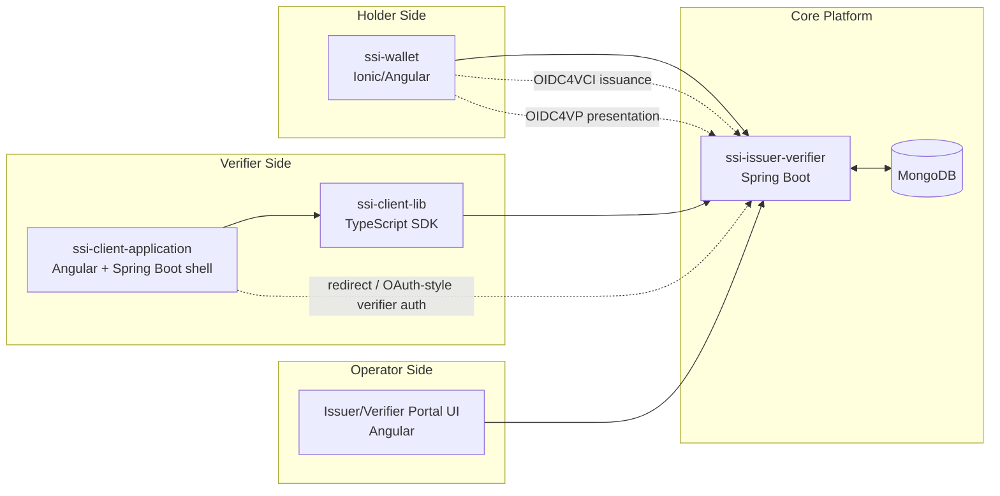
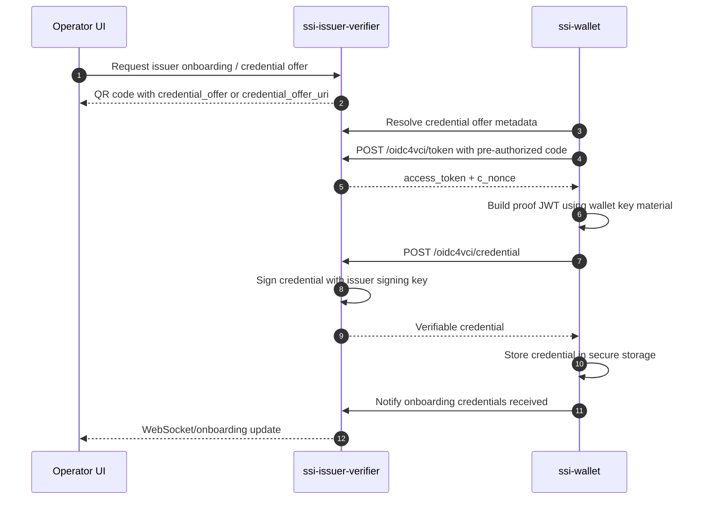
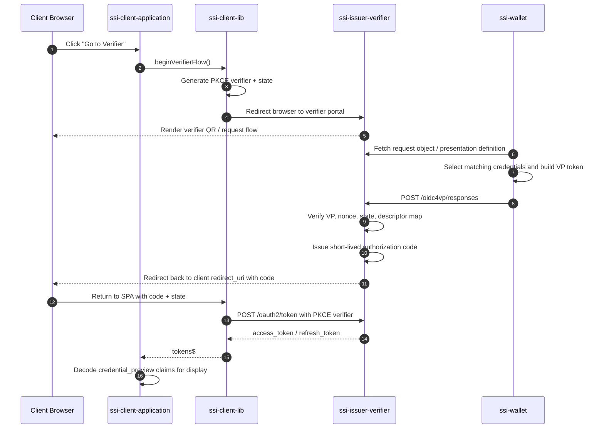
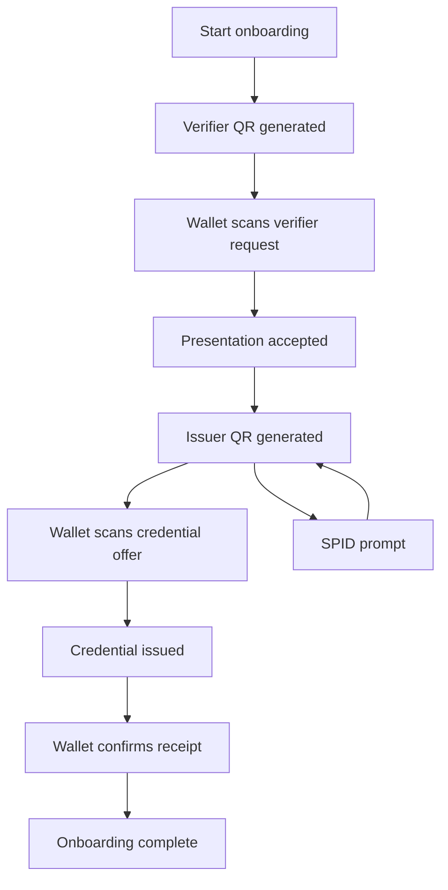
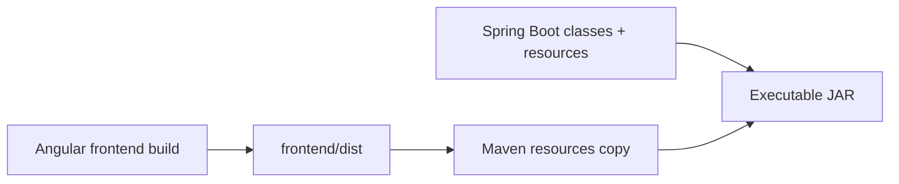
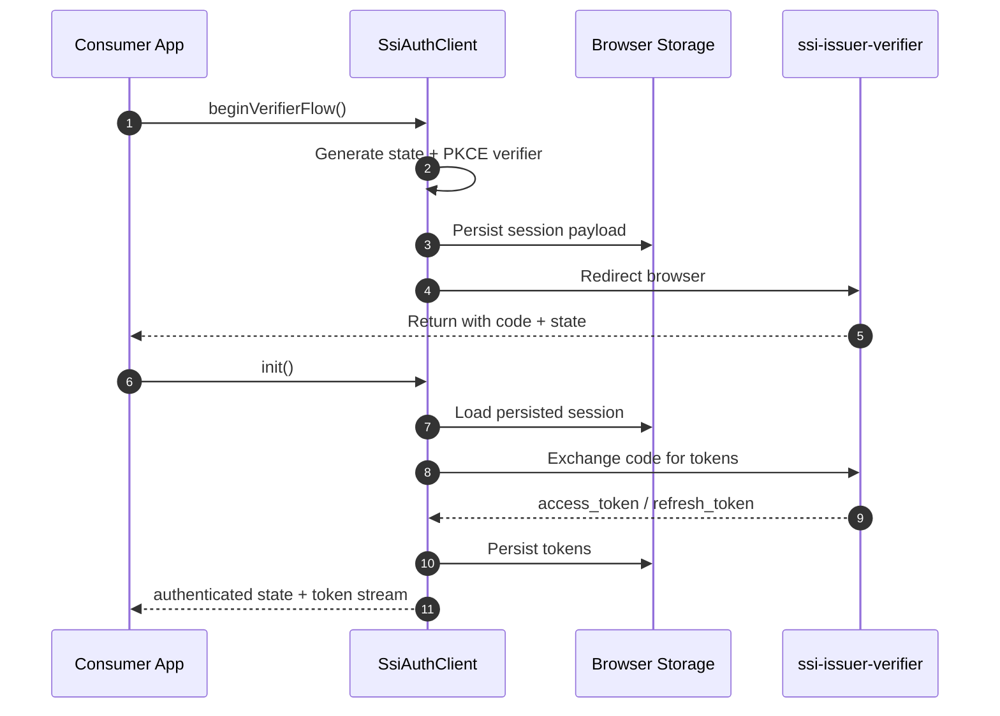
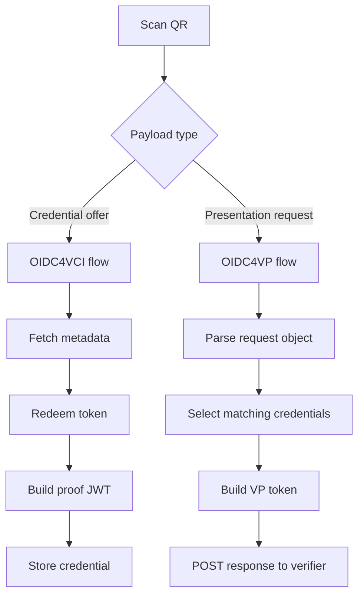

<!--
  SSI Ecosystem
  Copyright (c) 2026-present Izylife Solutions s.r.l.
  Author: Giuseppe Cassata

  This program is free software: you can redistribute it and/or modify
  it under the terms of the GNU Affero General Public License as published
  by the Free Software Foundation, either version 3 of the License,
  or (at your option) any later version.

  This program is distributed in the hope that it will be useful,
  but WITHOUT ANY WARRANTY; without even the implied warranty of
  MERCHANTABILITY or FITNESS FOR A PARTICULAR PURPOSE.
  See the GNU Affero General Public License for more details.

  You should have received a copy of the GNU Affero General Public License
  along with this program. If not, see <https://www.gnu.org/licenses/>.
-->

# Izylife SSI Ecosystem

This repository is a mono-repo for an end-to-end Self-Sovereign Identity demo. It contains the issuer and verifier portal, a sample verifier-facing client application, a reusable authentication SDK, and a holder wallet. Together these modules demonstrate credential issuance with OIDC4VCI, credential presentation with OIDC4VP, verifier authorization, onboarding orchestration, and optional SPID-based operator login.

## Table of Contents

- [What Is In This Repo](#what-is-in-this-repo)
- [Architecture Overview](#architecture-overview)
- [Main Runtime Flows](#main-runtime-flows)
- [Module Details](#module-details)
  - [`ssi-issuer-verifier`](#ssi-issuer-verifier)
  - [`ssi-client-application`](#ssi-client-application)
  - [`ssi-client-lib`](#ssi-client-lib)
  - [`ssi-wallet`](#ssi-wallet)
- [How The Modules Work Together](#how-the-modules-work-together)
- [Build And Run](#build-and-run)
- [Configuration Summary](#configuration-summary)
- [Important Endpoints](#important-endpoints)
- [Project Governance](#project-governance)
- [Development Notes](#development-notes)
- [Troubleshooting](#troubleshooting)

## What Is In This Repo

| Module | Role | Main Tech | Default Port |
| --- | --- | --- | --- |
| `ssi-issuer-verifier` | Core platform. Hosts issuer APIs, verifier APIs, onboarding state, admin APIs, SPID integration, and the operator UI. | Spring Boot 3.2, Angular 17, MongoDB | `9090` |
| `ssi-client-application` | Sample verifier-side application that uses the shared SDK to start verifier flows and consume returned tokens. | Spring Boot 3.5, Angular 20 | `9091` |
| `ssi-client-lib` | Reusable TypeScript SDK that wraps auth, PKCE, token handling, redirect recovery, and Angular integration. | TypeScript, tsup | n/a |
| `ssi-wallet` | Holder wallet used to scan QR codes, receive credentials, store them, and submit presentations. | Ionic 8, Angular 20, Capacitor 7 | `8100` in dev |

At the root you also have:

- `Makefile`: convenience commands for starting and stopping the demo.
- `docker-compose.yml`: containerized launcher for the issuer/verifier service and sample client.

## Architecture Overview

The issuer/verifier service is the center of the system. The sample client application and the wallet both depend on it, but in different ways:

- the client application depends on it as an authorization server and verifier portal,
- the wallet depends on it as an OIDC4VCI issuer and OIDC4VP verifier endpoint,
- the SDK exists to make that verifier integration reusable,
- MongoDB stores dynamic platform data such as tenants and related persisted configuration.



## Main Runtime Flows

### 1. Credential Issuance Flow

This is the holder onboarding path. The operator starts from the issuer/verifier portal, the wallet scans the generated QR code, and the backend completes an OIDC4VCI-style issuance exchange.



Important details:

- `ssi-issuer-verifier` exposes issuer metadata and credential offer endpoints.
- `ssi-wallet` resolves the offer, redeems the pre-authorized code, builds a proof JWT, and stores the resulting credential.
- onboarding is not only a QR rendering problem; it is a state machine managed by the backend and pushed to the UI over WebSockets.

### 2. Verifier Authorization + OIDC4VP Flow

This is the verifier-facing path. A browser user starts in the sample client app, is redirected to the verifier portal, the wallet submits a presentation, and the client application receives an access token representing the verified holder context.



Important details:

- the sample client does not directly implement OIDC4VP; it delegates that concern to the portal plus the shared SDK,
- the SDK keeps PKCE, state, token persistence, refresh timing, and original URL restoration in one place,
- the final verifier-facing token contains preview claims that the Angular sample UI decodes and shows to the user.

### 3. Onboarding State Flow

The operator UI does not just show a static page. It reacts to backend-managed onboarding transitions.



## Module Details

### `ssi-issuer-verifier`

This is the main platform module and the only part of the repo that actually implements SSI protocol endpoints. Everything else either consumes it or demonstrates how to integrate with it.

#### What It Contains

| Area | Purpose |
| --- | --- |
| `src/main/java/com/izylife/ssi/config` | Binds application properties, configures CORS, Mongo, security, SPID SAML, and WebSockets. |
| `src/main/java/com/izylife/ssi/controller` | REST and OIDC entry points for issuance, verification, onboarding, SPID, QR generation, and token exchange. |
| `src/main/java/com/izylife/ssi/controller/admin` | Admin APIs for admin login, tenant management, client management, and presentation definition management. |
| `src/main/java/com/izylife/ssi/service` | Business logic for issuance, request generation, verification, onboarding state, QR generation, Keycloak lookups, and token minting. |
| `src/main/java/com/izylife/ssi/security` | SPID success handling and custom admin authentication/token handling. |
| `src/main/java/com/izylife/ssi/model` | MongoDB-backed domain objects such as tenants, admin clients, and presentation definitions. |
| `src/main/java/com/izylife/ssi/repository` | Spring Data repositories for persistent models. |
| `src/main/resources/application.yml` | Main runtime configuration for issuer, verifier, CORS, MongoDB, SPID, and logging. |
| `frontend/src/app` | Angular operator UI for onboarding, issuance pages, admin screens, and presentation-definition management. |

#### Backend Responsibilities

1. OIDC4VCI issuer
   - exposes discovery metadata,
   - creates credential offers,
   - exchanges grants for access tokens,
   - signs and returns demo credentials.

2. OIDC4VP verifier
   - generates request objects,
   - publishes verifier JWKS,
   - accepts wallet responses,
   - validates the submission payload,
   - turns a successful presentation into an authorization code.

3. Verifier authorization server
   - receives the returned authorization code,
   - exchanges it at `/oauth2/token`,
   - returns access tokens used by verifier-side clients,
   - supports refresh-token based session continuation through the shared SDK.

4. Onboarding orchestrator
   - keeps track of which QR code or prompt should currently be shown,
   - publishes updates over SockJS/STOMP,
   - coordinates verifier step, issuer step, and wallet acknowledgements.

5. Operator platform
   - serves the Angular SPA,
   - optionally authenticates operators via SPID SAML,
   - supports admin login and administration endpoints,
   - can source presentation definitions from Keycloak.

#### Important Backend Classes

| Class / Group | Responsibility |
| --- | --- |
| `Oidc4vciService` | Core issuance state handling: credential offer records, authorization grants, access tokens, nonce handling, and demo profile data. |
| `Oidc4VpRequestService` | Builds verifier request objects and tracks authorization sessions. |
| `Oidc4VpResponseController` + `VerificationService` | Accept and validate wallet-submitted VP data, then promote it into verifier auth state. |
| `VerifierAuthorizationService` | Stores short-lived authorization codes issued after a successful presentation. |
| `VerifierTokenService` | Exchanges those codes for access tokens consumed by verifier clients. |
| `OnboardingStateService` | Maintains the onboarding state machine and emits updates to the Angular UI. |
| `PresentationDefinitionRegistry` | Resolves the active presentation definition, including fallback behavior. |
| `KeycloakPresentationDefinitionService` | Pulls `credentials.json` from Keycloak when that integration is enabled. |
| `AdminClientService` / `AdminPresentationDefinitionService` | Administrative CRUD for clients and presentation definitions. |
| `SpidSamlConfiguration` | Builds Spring Security SAML2 SP wiring for SPID support. |

#### Frontend Responsibilities

The Angular frontend inside this module is the operator-facing console. It is not a separate product; it is served by the same Spring Boot application.

| Frontend Area | Purpose |
| --- | --- |
| `onboarding-page` | Main verifier onboarding view. Shows current QR, errors, and step transitions. |
| `issuer-page` | Issuer-side onboarding step. Displays issuer QR or SPID prompt and credential preview details. |
| `admin/admin-login` | Admin login screen backed by custom admin auth endpoints. |
| `admin/admin-console` | Admin management surface. |
| `presentation-definition-builder` | UI for editing or building presentation definitions. |
| `services/onboarding.service.ts` | Fetches current onboarding state and subscribes to backend updates. |
| `services/admin-auth.service.ts` | Admin authentication client. |
| `services/admin-api.service.ts` | Admin API wrapper for console features. |

#### Data And Trust Boundaries

- MongoDB stores tenant and admin-related state, not wallet-held credentials.
- issuer and verifier signing keys are configured in `application.yml`; these are demo keys and should be replaced in any serious deployment.
- the wallet is the holder of issued credentials; the portal only issues and verifies, it does not act as the holder wallet.

#### Packaging Model

This module builds as a single executable JAR:



### `ssi-client-application`

This module is the sample verifier integration. It demonstrates how a third-party application would use the shared SDK to delegate SSI-heavy work to the issuer/verifier portal.

#### What It Contains

| Area | Purpose |
| --- | --- |
| `pom.xml` | Parent aggregator for `frontend` and `backend`. |
| `backend/` | Minimal Spring Boot app that can serve the built SPA and later host verifier-side APIs. |
| `frontend/` | Angular 20 SPA that integrates `@ssi/issuer-auth-client`. |

#### What The Backend Does

Right now the backend is intentionally thin:

- it starts a Spring Boot application on port `9091`,
- it serves static files copied from the Angular build,
- it gives you a place to add verifier-owned APIs later,
- it is not where SSI protocol logic lives.

That separation is important: this module demonstrates a consuming application, not a second SSI server.

#### What The Frontend Does

The Angular app is where the useful demo behavior currently lives:

- configures the SDK with the issuer/verifier base URL,
- uses the current browser origin as the redirect URI and client identifier,
- sends the browser into the verifier portal via `beginVerifierFlow()`,
- listens to `tokens$` from the Angular auth service,
- decodes the returned JWT access token,
- extracts `credential_preview.subject` claims and renders them to the user.

In practice, this module shows how a verifier can:

1. send a user to the portal,
2. wait for the wallet to complete presentation,
3. receive an access token carrying verified context,
4. continue application logic from there.

#### Why It Exists

Without this module, the repo would only show the platform side. This project proves the platform can be integrated from a normal browser-based app without embedding SSI protocol code everywhere.

#### Internal Runtime Flow


### `ssi-client-lib`

This is the reusable integration layer. It packages the auth and redirect behavior required by verifier-side frontends so that application teams do not have to reimplement PKCE, token storage, refresh scheduling, or redirect recovery.

#### What It Contains

| File / Area | Purpose |
| --- | --- |
| `src/SsiAuthClient.ts` | Framework-agnostic core client. |
| `src/types.ts` | Shared TypeScript contracts for config, tokens, events, and options. |
| `src/utils.ts` | PKCE, URL building, storage helpers, JWT decoding, and expiration utilities. |
| `src/angular/service.ts` | Angular facade exposing observables and delegation methods. |
| `src/angular/interceptor.ts` | Optional `HttpClient` interceptor that injects bearer tokens. |
| `src/angular/tokens.ts` | Angular DI tokens. |
| `src/angular/index.ts` | `provideSsiAuth()` entry point. |

#### Installation And Consumption

The library is published as a standard npm package shape and can be consumed in
two common ways inside this mono-repo:

1. published package consumption,
2. local tarball consumption for coordinated development with the sample client.

Install from npm:

```bash
npm install '@izylife/ssi-auth-client'
```

For local development inside this repository:

```bash
cd ssi-client-lib
npm install
npm run build
npm pack
```

That produces a tarball which can be referenced by another frontend package.
The sample client application already demonstrates this model through a local
file dependency in `ssi-client-application/frontend/package.json`.

Peer dependencies are only needed when you use the Angular integration:

- `@angular/core`
- `@angular/common`
- `rxjs`

#### Core Responsibilities

1. Session bootstrap
   - restore stored tokens,
   - inspect the current URL for `code` and `state`,
   - complete redirect callbacks,
   - optionally trigger `login-required` behavior.

2. Authorization flow management
   - create PKCE verifier/challenge pairs,
   - generate and persist state,
   - build authorization URLs,
   - redirect the browser to the portal.

3. Verifier portal integration
   - `beginVerifierFlow()` behaves like login, but targets the verifier portal path rather than the plain auth path,
   - it preserves the original browser location so the SPA can resume where it started after redirect completion.

4. Token lifecycle handling
   - persist access, refresh, and ID tokens,
   - schedule refresh before expiry,
   - emit lifecycle events such as `authenticated`, `token_refreshed`, `token_expired`, `logout`, and `error`.

5. Angular integration
   - `provideSsiAuth()` wires the client into Angular dependency injection,
   - `SsiAuthService` exposes `authStatus$` and `tokens$`,
   - `SsiAuthInterceptor` can attach bearer tokens to outgoing HTTP calls.

#### Typical Angular Integration

The intended Angular bootstrap model is:

```ts
import { provideHttpClient, withInterceptorsFromDi } from '@angular/common/http';
import { provideSsiAuth } from '@izylife/ssi-auth-client/angular';

provideHttpClient(withInterceptorsFromDi());

provideSsiAuth({
  config: {
    baseUrl: 'https://issuer.example.com',
    clientId: 'ssi-portal-ui',
    redirectUri: `${window.location.origin}/auth/callback`,
    scopes: ['openid', 'profile', 'ssi:presentations'],
    refreshSkewMs: 60_000
  },
  initOptions: {
    onLoad: 'check-sso',
    restoreOriginalUri: true
  },
  includeHttpInterceptor: true
});
```

In application code, `SsiAuthService` is the normal façade used by Angular
components. It exposes auth state streams, tokens, and the helper methods that
delegate to the core client.

#### API Surface Summary

Core client highlights:

- `init()`
- `login()`
- `beginVerifierFlow()`
- `logout()`
- `getAccessToken()`
- `getIdToken()`
- `fetchWithAuth()`
- lifecycle events through `on(...)`

Angular helper highlights:

- `provideSsiAuth(...)`
- `SsiAuthService`
- `SsiAuthInterceptor`

#### Why It Matters

This library is what keeps verifier-facing applications small. The sample client application stays simple because protocol-adjacent browser concerns live here instead of in application components.

#### SDK Redirect Handling Flow



### `ssi-wallet`

This module is the holder side of the demo. It receives credentials and later presents them back to the verifier portal. It is an Ionic/Angular mobile application packaged through Capacitor, so it can run as a web app during development and as a native mobile app for device testing.

#### What It Contains

| Area | Purpose |
| --- | --- |
| `mobile-app/src/app/tab1` | Main action screen for QR scanning, credential offer acceptance, and VP submission. |
| `mobile-app/src/app/services/oidc4vc.service.ts` | OIDC4VCI client logic: parse offer URIs, fetch issuer metadata, redeem codes, request credentials. |
| `mobile-app/src/app/services/oidc4vp.service.ts` | OIDC4VP client logic: parse requests, select credentials, build VP token, post presentation responses. |
| `mobile-app/src/app/services/credential.service.ts` | Secure persistence for verifiable credentials. |
| `mobile-app/src/app/services/did.service.ts` | Creates and stores a `did:key` document derived from wallet key material. |
| `mobile-app/src/app/services/key.service.ts` | Key pair generation and persistence used by issuance proofs and VP signing. |
| `mobile-app/src/app/services/biometric-auth.service.ts` | Local biometric gating support. |
| `mobile-app/src/app/services/biometric.guard.ts` | Route guard for biometric-protected sections. |
| `docs/` | Supporting implementation notes and development guides. |

#### Prerequisites

For wallet development in general:

- Node.js 18+
- npm 10+
- Ionic CLI installed globally: `npm install -g @ionic/cli`

For Android specifically:

- Android Studio
- Android SDKs installed through Android Studio
- `ANDROID_HOME` configured
- Android `platform-tools` added to `PATH`
- an Android emulator or USB-debuggable device when running on hardware

#### Wallet Responsibilities

1. QR scanning
   - the main tab uses the browser or WebView camera,
   - detects QR payloads,
   - decides whether the payload is an OIDC4VCI or OIDC4VP request.

2. Credential issuance consumption
   - parse `openid-credential-offer` URIs,
   - resolve inline or remote credential offers,
   - fetch issuer metadata,
   - redeem a pre-authorized code,
   - build a proof JWT,
   - request and store the credential.

3. Presentation submission
   - parse OIDC4VP request URIs or request objects,
   - load stored credentials,
   - derive or restore wallet DID and signing keys,
   - build a verifiable presentation,
   - wrap it into a VP token JWT,
   - send it to the verifier response endpoint.

4. Local identity management
   - creates a `did:key` identifier from a P-256 public key,
   - stores DID and credentials using secure storage plugins when available,
   - falls back to in-memory behavior if secure storage is unavailable.

#### Wallet Installation

Bootstrap the wallet from the wallet module root:

```bash
cd ssi-wallet/mobile-app
npm install
```

This installs Angular, Ionic, Capacitor, secure-storage support, biometric
helpers, and the testing/build tooling used by the app.

For browser-only development:

```bash
cd ssi-wallet
make serve
```

That starts the Ionic dev server on `http://localhost:8100`.

#### Android Installation And First Run

The Android path is the main native workflow documented by this repository.

1. Install dependencies:

   ```bash
   cd ssi-wallet/mobile-app
   npm install
   ```

2. Add the Android platform the first time:

   ```bash
   cd /home/gcassata/gitrepos/ssi-ecosystem/ssi-wallet
   make add-android
   ```

3. Build the web assets:

   ```bash
   cd /home/gcassata/gitrepos/ssi-ecosystem/ssi-wallet
   make build
   ```

4. Sync the built web assets into the native Android shell:

   ```bash
   cd /home/gcassata/gitrepos/ssi-ecosystem/ssi-wallet
   make sync
   ```

5. Run on Android:

   ```bash
   cd /home/gcassata/gitrepos/ssi-ecosystem/ssi-wallet
   make run-android
   ```

Important notes:

- Capacitor commands must effectively run inside `ssi-wallet/mobile-app`, even
  when you trigger them through the wallet `Makefile`.
- If `npx cap add android` fails with an error like `could not determine
  executable to run`, it usually means the command was run outside the Ionic app
  directory or before installing dependencies.
- After every frontend code change intended for the native app, run `make sync`
  again before rebuilding or rerunning from Android Studio.

#### Opening In Android Studio

Once the Android platform has been added, you can open the generated native
project directly from inside `mobile-app` with Capacitor tooling:

```bash
cd ssi-wallet/mobile-app
npx cap open android
```

This is the right workflow when you need emulator management, native logs,
signing configuration, or APK/AAB generation through Android Studio.

#### Android Debugging Notes

For Android WebView debugging:

- enable USB debugging on the device or use an emulator,
- use `adb` to confirm the device is visible,
- if you need WebView inspection, follow `ssi-wallet/docs/ionic-dev.md` for
  devtools socket forwarding and Chrome remote debugging.

The repository documentation also notes a live-reload Android flow
(`make run-android-live HOST_IP=<reachable-ip>`), but that target is currently
described in the docs more explicitly than in the checked-in `Makefile`. Treat
the non-live `make run-android` path as the canonical supported command in the
current repository state.

#### Why It Matters

Without this module, the repo would only simulate holder actions. This wallet proves that the issuer and verifier flows are consumable by an actual holder application that:

- manages its own keys,
- stores credentials locally,
- signs proofs and presentations,
- responds to QR-driven protocol hand-offs.

#### Wallet Processing Flow



## How The Modules Work Together

The repo is easiest to understand if you think of the modules by ownership boundary:

- `ssi-issuer-verifier` is the platform and protocol owner.
- `ssi-client-lib` is the verifier integration toolkit.
- `ssi-client-application` is the verifier consumer example.
- `ssi-wallet` is the holder example.

Another way to read the same boundary is:

- operator uses `ssi-issuer-verifier`,
- verifier integrates `ssi-client-lib`,
- browser-based verifier app is shown by `ssi-client-application`,
- holder uses `ssi-wallet`.

## Build And Run

### Prerequisites

- Java 17+
- Maven 3.9+
- Node.js 18+ for Angular/Ionic work
- npm 10+
- MongoDB 7+ or Docker

### Start MongoDB

```bash
docker run --name ssi-mongo -p 27017:27017 -d mongo:7
```

### Recommended Manual Startup

Start each runtime explicitly the first time so it is clear what is happening.

#### 1. Start the issuer/verifier portal

```bash
cd ssi-issuer-verifier
mvn spring-boot:run
```

This runs the backend on `http://localhost:9090`. The Maven build will also manage the Angular frontend build when packaging.

#### 2. Start the sample client application

```bash
cd ssi-client-application
mvn -f backend/pom.xml generate-resources
mvn -f backend/pom.xml spring-boot:run
```

This runs the sample verifier app on `http://localhost:9091`.

#### 3. Start the wallet in web mode

```bash
cd ssi-wallet/mobile-app
npm install
npm start
```

This runs the wallet dev server on `http://localhost:8100`.

### Root-Level Convenience Commands

The root `Makefile` includes helper targets:

- `make run-ssi-demo`
- `make stop-ssi-demo`
- `make logs`
- `make clean`

Use these as shortcuts when they match your workflow, but the module-specific commands above are the clearest way to understand and debug the system.

### Docker Compose

The root `docker-compose.yml` builds and starts:

- `ssi-issuer-verifier`
- `ssi-client`

It expects MongoDB to be reachable through `host.docker.internal`.

## Configuration Summary

### `ssi-issuer-verifier`

Main settings live in `src/main/resources/application.yml`.

| Setting | Meaning |
| --- | --- |
| `server.port` | HTTP port for the core platform. |
| `app.issuer.endpoint` | Public issuer base URL used in metadata and offers. |
| `app.issuer.credential-issuer-id` | OIDC4VCI issuer identifier. |
| `app.issuer.signing-key.*` | Demo issuer signing JWK used to sign credentials. |
| `app.verifier.endpoint` | Public verifier base URL. |
| `app.verifier.qr-payload` | Default verifier QR payload seed. |
| `app.verifier.client-id` | Verifier response target used in OIDC4VP direct-post mode. |
| `app.verifier.signing-key.*` | Demo verifier signing JWK. |
| `spring.data.mongodb.*` | MongoDB connection information. |
| `app.spid.*` | SPID SAML service-provider settings. |

### `ssi-client-application`

The Angular app configures the SDK in `frontend/src/app/app.config.ts`.

Key choices made there:

- `baseUrl` points to the issuer/verifier platform,
- `redirectUri` is the current browser origin,
- `clientId` is derived from that same origin,
- `portalPath` is `/verifier`,
- `client_id_scheme=redirect_uri` is passed as a portal parameter.

### `ssi-client-lib`

The SDK accepts config for:

- `baseUrl`
- `clientId`
- `redirectUri`
- `postLogoutRedirectUri`
- `portalPath`
- `portalParams`
- `scopes`
- `refreshTokens`
- `refreshSkewMs`
- `storageKey`
- custom endpoint overrides

### `ssi-wallet`

Wallet runtime settings live under `mobile-app/src/environments/`.

Most of the protocol behavior is currently driven by scanned payloads rather than a large static config object, which keeps the wallet flexible during demos.

Android-specific setup still depends on local machine tooling:

- Android Studio and SDK installation,
- `ANDROID_HOME`,
- `platform-tools` on `PATH`,
- an emulator or device reachable through `adb`.

## Important Endpoints

### Issuer Endpoints

| Endpoint | Method | Purpose |
| --- | --- | --- |
| `/.well-known/openid-credential-issuer` | `GET` | OIDC4VCI issuer metadata |
| `/.well-known/oauth-authorization-server` | `GET` | OAuth/OIDC authorization server metadata |
| `/oidc4vci/credential-offers/{offerId}` | `GET` | Resolve a stored credential offer |
| `/oidc4vci/token` | `POST` | Exchange authorization or pre-authorized codes |
| `/oidc4vci/credential` | `POST` | Issue the actual credential |
| `/oidc4vci/jwks.json` | `GET` | Issuer JWKS |

### Verifier Endpoints

| Endpoint | Method | Purpose |
| --- | --- | --- |
| `/oidc4vp/requests/{requestId}` | `GET` | Request object for a wallet presentation flow |
| `/oidc4vp/responses` | `POST` | Wallet-submitted VP response |
| `/oidc4vp/jwks.json` | `GET` | Verifier JWKS |
| `/oauth2/token` | `POST` | Exchange verifier auth code for access token |

### Platform APIs

| Endpoint | Method | Purpose |
| --- | --- | --- |
| `/api/credentials/templates` | `GET` | List credential templates |
| `/api/credentials/issue` | `POST` | Demo issuance helper |
| `/api/verification/presentations` | `POST` | Programmatic verification endpoint |
| `/api/onboarding/*` | `GET/POST` | Onboarding state and acknowledgements |
| `/api/tenants` | `GET/POST` | Tenant registration and listing |
| `/spid/metadata` | `GET` | Export SPID metadata |

### Admin APIs

Admin features are exposed under `controller/admin` and support:

- admin authentication,
- tenant administration,
- client administration,
- presentation definition administration.

## Project Governance

The repository now includes the standard project governance documents at root:

- `LICENSE`
- `CODE_OF_CONDUCT.md`
- `CONTRIBUTING.md`

The repository root is licensed under `AGPL-3.0-only`, except where a
subdirectory explicitly ships its own license file.

The contribution policy is explicit: if someone modifies or improves the code,
the work is only considered a valid contribution after it has been committed and
pushed to a remote branch. That is a project rule documented in
`CONTRIBUTING.md`.

One practical constraint remains: Git cannot force a remote push purely through
files committed inside the repository. To enforce that rule in practice, the
hosting platform should also enable:

- protected branches,
- pull requests as the default merge path,
- required CI checks,
- restricted direct pushes to the main branch.

## Development Notes

### Frontend Development

- `ssi-issuer-verifier/frontend` contains the Angular operator UI.
- `ssi-client-application/frontend` contains the Angular verifier sample UI.
- `ssi-wallet/mobile-app` contains the Ionic wallet UI.

These frontends are intentionally separate because they represent different actors and trust boundaries.

### Packaging Strategy

- `ssi-issuer-verifier` packages its Angular build into one Spring Boot JAR.
- `ssi-client-application` packages its Angular build into the backend static resources.
- `ssi-client-lib` produces reusable npm bundles instead of a server artifact.
- `ssi-wallet` produces a web build and can be synchronized into native shells via Capacitor.

### Keycloak Presentation Definitions

The issuer/verifier platform can source the active OIDC4VP presentation definition from Keycloak instead of only using the bundled `staff-credential.json`.

That integration exists so presentation requirements can be managed operationally without rebuilding the Spring Boot service.

### SPID Support

SPID support is optional and only affects operator authentication in the issuer/verifier platform. It does not replace the wallet or verifier protocol flows.

## Troubleshooting

| Problem | Likely Cause | What To Check |
| --- | --- | --- |
| Wallet cannot obtain a credential | Issuer endpoint mismatch or unreachable public URL | `app.issuer.endpoint`, ngrok/public hostname, issuer metadata |
| Wallet cannot submit presentation | Request object or response URI mismatch | verifier endpoint, request URI, `response_mode`, nonce/state values |
| Client app never becomes authenticated | Redirect URI or `client_id_scheme` mismatch | Angular app config in `ssi-client-application`, backend logs in `ssi-issuer-verifier` |
| Frontend build missing from Spring app | Angular build output not copied into static resources | Maven `generate-resources` / `package` step |
| Mongo connection errors | Database not running or wrong URI | `SPRING_DATA_MONGODB_URI` |
| SPID login problems | SAML metadata or signing cert/key mismatch | `app.spid.*`, metadata export, DEBUG SAML logs |
| Token refresh not happening | Missing refresh token or refresh timing config | SDK config and `/oauth2/token` behavior |

## Related Module READMEs

Each module also has its own README:

- `ssi-issuer-verifier/README.md`
- `ssi-client-application/README.md`
- `ssi-client-lib/README.md`
- `ssi-wallet/README.md`

Those files are useful when you are working inside one module. This root README is the system-level view that explains how the modules relate to each other.
