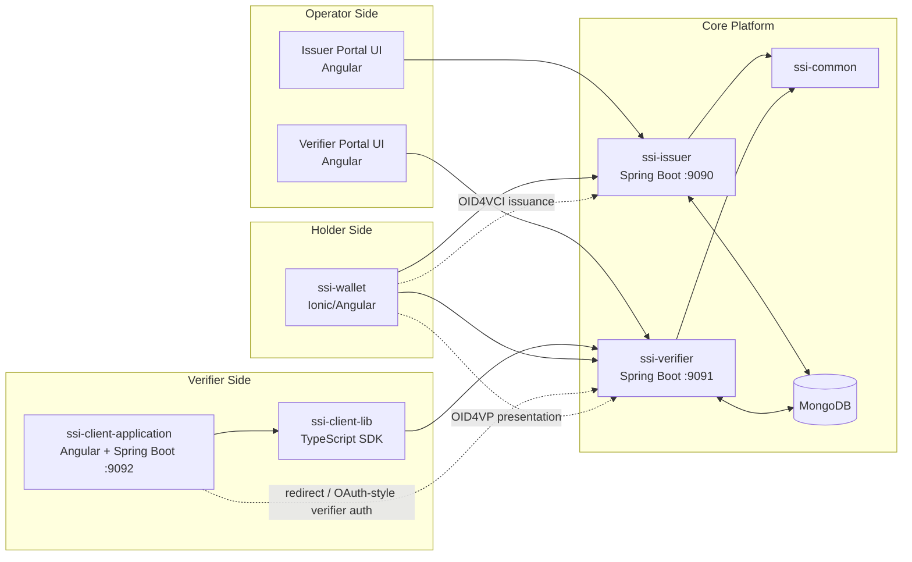
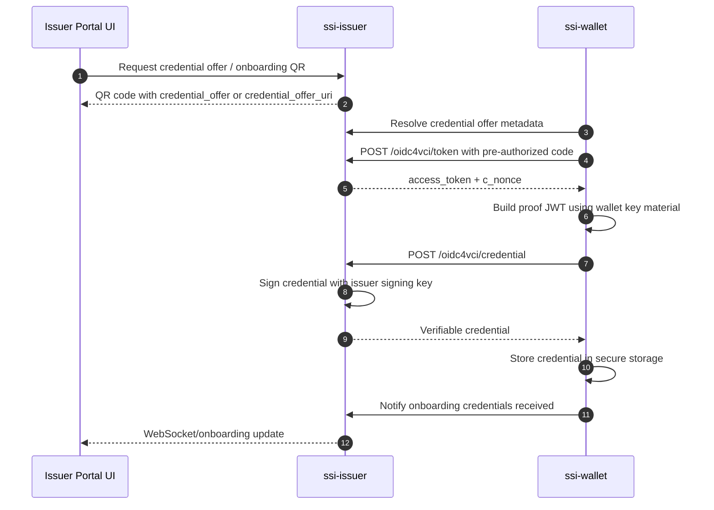
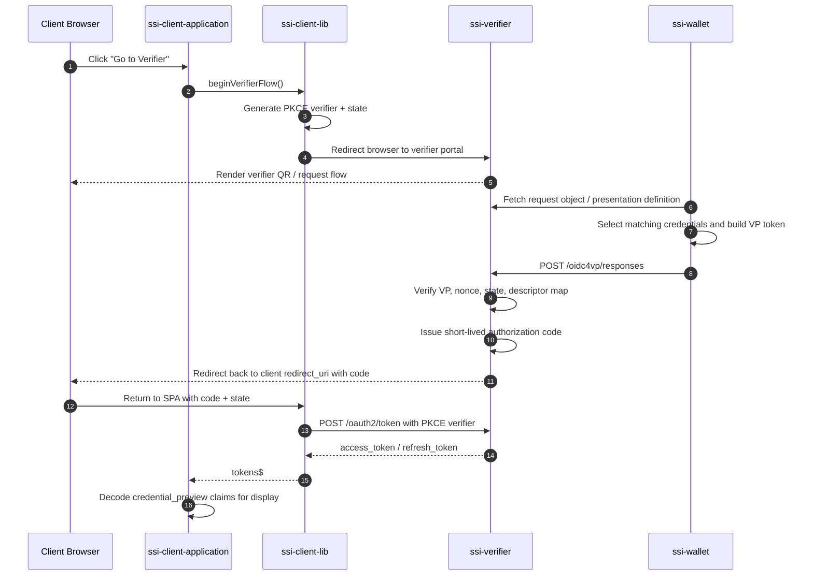
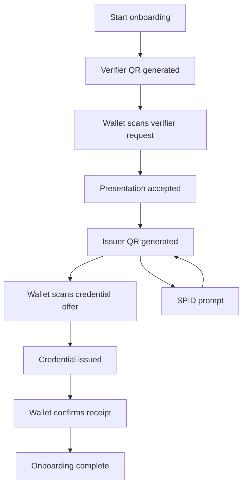
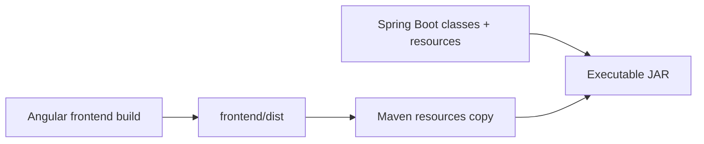
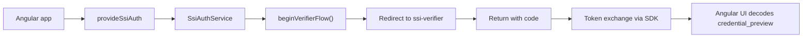
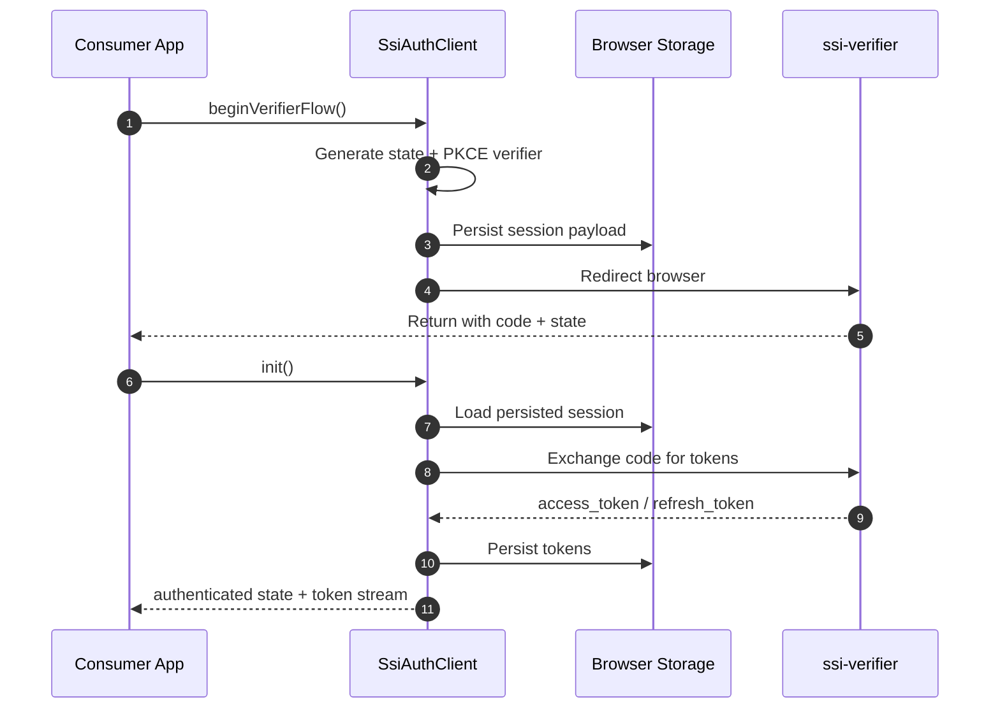
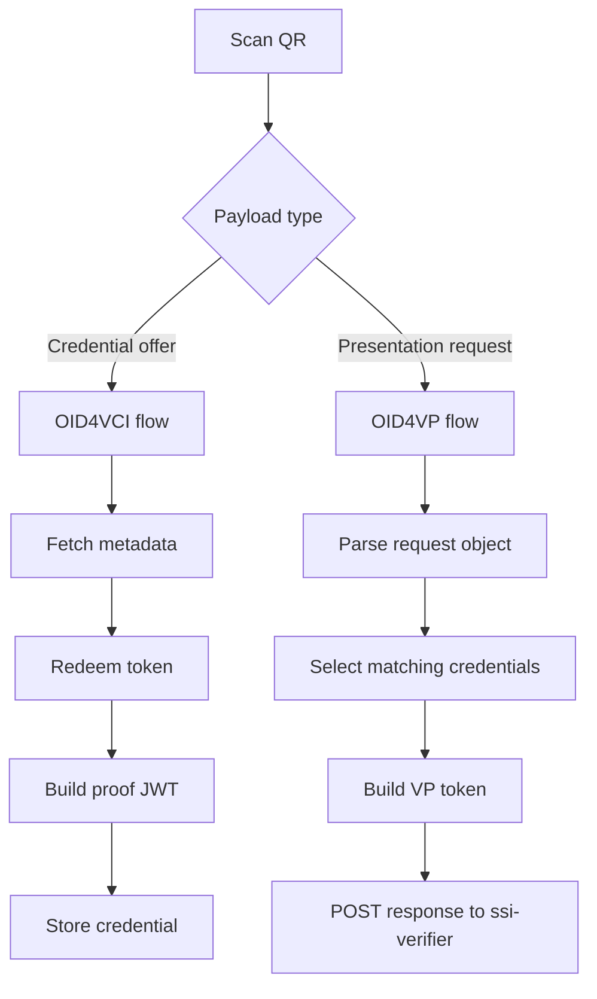

<!--
  SSI Ecosystem
  Copyright (c) 2026-present Izylife Solutions s.r.l.
  Author: Giuseppe Cassata

  This program is free software: you can redistribute it and/or modify
  it under the terms of the GNU Affero General Public License as published
  by the Free Software Foundation, either version 3 of the License,
  or (at your option) any later version.

  This program is distributed in the hope that it will be useful,
  but WITHOUT ANY WARRANTY; without even the implied warranty of
  MERCHANTABILITY or FITNESS FOR A PARTICULAR PURPOSE.
  See the GNU Affero General Public License for more details.

  You should have received a copy of the GNU Affero General Public License
  along with this program. If not, see <https://www.gnu.org/licenses/>.
-->

# Izylife SSI Ecosystem

<svg viewBox="0 0 1240 780" xmlns="http://www.w3.org/2000/svg" font-family="'Segoe UI', Roboto, Helvetica, Arial, sans-serif">
  <defs>
    <marker id="arrow" markerWidth="10" markerHeight="10" refX="8" refY="3" orient="auto" markerUnits="strokeWidth">
      <path d="M0,0 L8,3 L0,6 Z" fill="#475569"/>
    </marker>
    <marker id="arrowB" markerWidth="10" markerHeight="10" refX="8" refY="3" orient="auto" markerUnits="strokeWidth">
      <path d="M0,0 L8,3 L0,6 Z" fill="#0ea5e9"/>
    </marker>
    <linearGradient id="bg" x1="0" y1="0" x2="0" y2="1">
      <stop offset="0" stop-color="#ffffff"/>
      <stop offset="1" stop-color="#f8fafc"/>
    </linearGradient>
  </defs>

  <rect x="0" y="0" width="1240" height="780" fill="url(#bg)"/>

  <!-- Title -->
  <text x="60" y="52" font-size="28" font-weight="700" fill="#0f172a">Izylife SSI Ecosystem — Architecture</text>
  <text x="60" y="80" font-size="15" fill="#64748b">End-to-end Self-Sovereign Identity · issuer / holder / verifier · standards-first (OpenID4VC)</text>
  <line x1="60" y1="96" x2="1180" y2="96" stroke="#e2e8f0" stroke-width="1"/>

  <!-- ================= HOLDER (left) ================= -->
  <g>
    <rect x="60" y="150" width="300" height="300" rx="14" fill="#ecfdf5" stroke="#10b981" stroke-width="2"/>
    <rect x="60" y="150" width="300" height="40" rx="14" fill="#059669"/>
    <rect x="60" y="176" width="300" height="14" fill="#059669"/>
    <text x="80" y="177" font-size="17" font-weight="700" fill="#ffffff">HOLDER</text>
    <text x="340" y="177" font-size="13" fill="#d1fae5" text-anchor="end">ssi-wallet</text>

    <text x="80" y="214" font-size="14" fill="#065f46" font-weight="600">Ionic 8 · Angular 20 · Capacitor 7</text>

    <rect x="80" y="228" width="260" height="38" rx="8" fill="#ffffff" stroke="#a7f3d0"/>
    <text x="92" y="246" font-size="13.5" font-weight="600" fill="#0f172a">OIDC4VCI client</text>
    <text x="92" y="261" font-size="11.5" fill="#64748b">resolve offer · proof JWT · store credential</text>

    <rect x="80" y="274" width="260" height="38" rx="8" fill="#ffffff" stroke="#a7f3d0"/>
    <text x="92" y="292" font-size="13.5" font-weight="600" fill="#0f172a">OIDC4VP client</text>
    <text x="92" y="307" font-size="11.5" fill="#64748b">select credentials · build &amp; sign VP token</text>

    <rect x="80" y="320" width="260" height="38" rx="8" fill="#ffffff" stroke="#a7f3d0"/>
    <text x="92" y="338" font-size="13.5" font-weight="600" fill="#0f172a">did:key identity (P-256)</text>
    <text x="92" y="353" font-size="11.5" fill="#64748b">wallet-generated &amp; held key material</text>

    <rect x="80" y="366" width="260" height="38" rx="8" fill="#ffffff" stroke="#a7f3d0"/>
    <text x="92" y="384" font-size="13.5" font-weight="600" fill="#0f172a">Secure storage + biometric guard</text>
    <text x="92" y="399" font-size="11.5" fill="#64748b">credentials never leave the holder</text>

    <text x="80" y="430" font-size="12" fill="#059669" font-style="italic">The holder holds the keys.</text>
  </g>

  <!-- ================= CORE PLATFORM (center) ================= -->
  <g>
    <rect x="450" y="130" width="340" height="430" rx="14" fill="#eef2ff" stroke="#6366f1" stroke-width="2"/>
    <rect x="450" y="130" width="340" height="40" rx="14" fill="#4f46e5"/>
    <rect x="450" y="156" width="340" height="14" fill="#4f46e5"/>
    <text x="470" y="157" font-size="17" font-weight="700" fill="#ffffff">CORE PLATFORM</text>
    <text x="770" y="157" font-size="13" fill="#c7d2fe" text-anchor="end">ssi-issuer-verifier</text>

    <text x="470" y="194" font-size="14" fill="#3730a3" font-weight="600">Spring Boot 3.2 · Angular 17 · MongoDB · :9090</text>
    <text x="470" y="212" font-size="11.5" fill="#6366f1">single protocol owner — everything else is a consumer</text>

    <rect x="470" y="226" width="300" height="44" rx="8" fill="#ffffff" stroke="#c7d2fe"/>
    <text x="482" y="245" font-size="13.5" font-weight="600" fill="#0f172a">OIDC4VCI Issuer</text>
    <text x="482" y="261" font-size="11.5" fill="#64748b">offers · token · credential signing · JWKS</text>

    <rect x="470" y="278" width="300" height="44" rx="8" fill="#ffffff" stroke="#c7d2fe"/>
    <text x="482" y="297" font-size="13.5" font-weight="600" fill="#0f172a">OIDC4VP Verifier</text>
    <text x="482" y="313" font-size="11.5" fill="#64748b">request objects · VP validation · descriptor map</text>

    <rect x="470" y="330" width="300" height="44" rx="8" fill="#ffffff" stroke="#c7d2fe"/>
    <text x="482" y="349" font-size="13.5" font-weight="600" fill="#0f172a">OAuth2 Authorization Server</text>
    <text x="482" y="365" font-size="11.5" fill="#64748b">PKCE · short-lived codes · /oauth2/token</text>

    <rect x="470" y="382" width="300" height="44" rx="8" fill="#ffffff" stroke="#c7d2fe"/>
    <text x="482" y="401" font-size="13.5" font-weight="600" fill="#0f172a">Onboarding Orchestrator</text>
    <text x="482" y="417" font-size="11.5" fill="#64748b">server-side state machine → WebSocket (STOMP)</text>

    <rect x="470" y="434" width="300" height="44" rx="8" fill="#ffffff" stroke="#c7d2fe"/>
    <text x="482" y="453" font-size="13.5" font-weight="600" fill="#0f172a">Operator UI + Admin (Angular)</text>
    <text x="482" y="469" font-size="11.5" fill="#64748b">tenants · clients · presentation definitions</text>

    <rect x="470" y="486" width="300" height="34" rx="8" fill="#eef2ff" stroke="#c7d2fe" stroke-dasharray="4 3"/>
    <text x="482" y="507" font-size="12" fill="#4338ca">SPID SAML2 — optional operator login</text>
  </g>

  <!-- MongoDB cylinder -->
  <g>
    <ellipse cx="620" cy="600" rx="70" ry="14" fill="#cbd5e1" stroke="#94a3b8"/>
    <path d="M550,600 v44 a70,14 0 0 0 140,0 v-44" fill="#e2e8f0" stroke="#94a3b8"/>
    <ellipse cx="620" cy="600" rx="70" ry="14" fill="#f1f5f9" stroke="#94a3b8"/>
    <text x="620" y="628" font-size="13" font-weight="600" fill="#334155" text-anchor="middle">MongoDB</text>
    <text x="620" y="666" font-size="11" fill="#64748b" text-anchor="middle">tenant / admin config —</text>
    <text x="620" y="681" font-size="11" fill="#64748b" text-anchor="middle">not holder credentials</text>
    <line x1="620" y1="560" x2="620" y2="586" stroke="#94a3b8" stroke-width="1.5" marker-end="url(#arrow)"/>
  </g>

  <!-- ================= VERIFIER (right) ================= -->
  <g>
    <rect x="880" y="150" width="300" height="120" rx="14" fill="#fff7ed" stroke="#f59e0b" stroke-width="2"/>
    <rect x="880" y="150" width="300" height="40" rx="14" fill="#d97706"/>
    <rect x="880" y="176" width="300" height="14" fill="#d97706"/>
    <text x="900" y="177" font-size="17" font-weight="700" fill="#ffffff">VERIFIER APP</text>
    <text x="1160" y="177" font-size="13" fill="#fde68a" text-anchor="end">ssi-client-application</text>
    <text x="900" y="216" font-size="13.5" fill="#92400e" font-weight="600">Spring Boot 3.5 · Angular 20 · :9091</text>
    <text x="900" y="238" font-size="11.5" fill="#64748b">thin consumer — zero protocol code</text>
    <text x="900" y="256" font-size="11.5" fill="#64748b">beginVerifierFlow() → decode verified claims</text>

    <rect x="880" y="300" width="300" height="150" rx="14" fill="#fffbeb" stroke="#f59e0b" stroke-width="2"/>
    <rect x="880" y="300" width="300" height="40" rx="14" fill="#b45309"/>
    <rect x="880" y="326" width="300" height="14" fill="#b45309"/>
    <text x="900" y="327" font-size="17" font-weight="700" fill="#ffffff">INTEGRATION SDK</text>
    <text x="1160" y="327" font-size="13" fill="#fde68a" text-anchor="end">ssi-client-lib</text>
    <text x="900" y="366" font-size="13.5" fill="#92400e" font-weight="600">TypeScript · @izylife/ssi-auth-client</text>
    <text x="900" y="388" font-size="11.5" fill="#64748b">PKCE + state generation</text>
    <text x="900" y="406" font-size="11.5" fill="#64748b">token lifecycle · refresh scheduling · events</text>
    <text x="900" y="424" font-size="11.5" fill="#64748b">redirect recovery · Angular provider + interceptor</text>
    <text x="900" y="442" font-size="11.5" fill="#64748b">keeps verifier apps small</text>
  </g>

  <!-- ================= ARROWS ================= -->
  <!-- wallet -> core : OIDC4VCI -->
  <line x1="360" y1="247" x2="450" y2="247" stroke="#0ea5e9" stroke-width="2.2" marker-end="url(#arrowB)"/>
  <rect x="312" y="194" width="186" height="22" rx="11" fill="#ffffff" stroke="#0ea5e9"/>
  <text x="405" y="209" font-size="12" font-weight="600" fill="#0369a1" text-anchor="middle">OIDC4VCI — issuance</text>

  <!-- wallet -> core : OIDC4VP -->
  <line x1="360" y1="293" x2="450" y2="300" stroke="#0ea5e9" stroke-width="2.2" marker-end="url(#arrowB)"/>
  <rect x="312" y="320" width="200" height="22" rx="11" fill="#ffffff" stroke="#0ea5e9"/>
  <text x="412" y="335" font-size="12" font-weight="600" fill="#0369a1" text-anchor="middle">OIDC4VP — presentation</text>

  <!-- SDK -> core : OAuth2/PKCE token -->
  <line x1="880" y1="375" x2="790" y2="352" stroke="#475569" stroke-width="2.2" marker-end="url(#arrow)"/>
  <rect x="742" y="316" width="196" height="22" rx="11" fill="#ffffff" stroke="#94a3b8"/>
  <text x="840" y="331" font-size="12" font-weight="600" fill="#334155" text-anchor="middle">OAuth2 / PKCE token exchange</text>

  <!-- client app -> SDK -->
  <line x1="1030" y1="270" x2="1030" y2="300" stroke="#475569" stroke-width="2.2" marker-end="url(#arrow)"/>
  <rect x="978" y="276" width="104" height="20" rx="10" fill="#ffffff" stroke="#94a3b8"/>
  <text x="1030" y="290" font-size="11" font-weight="600" fill="#334155" text-anchor="middle">delegates auth</text>

  <!-- core -> verifier app : redirect back with verified claims -->
  <path d="M790,470 C840,470 850,250 880,224" fill="none" stroke="#475569" stroke-width="2" stroke-dasharray="5 4" marker-end="url(#arrow)"/>
  <rect x="792" y="486" width="92" height="20" rx="10" fill="#ffffff" stroke="#94a3b8"/>
  <text x="838" y="500" font-size="11" fill="#334155" text-anchor="middle">redirect + code</text>

  <!-- ================= STANDARDS STRIP ================= -->
  <line x1="60" y1="708" x2="1180" y2="708" stroke="#e2e8f0" stroke-width="1"/>
  <text x="60" y="734" font-size="12.5" fill="#64748b" font-weight="600">Standards &amp; stack:</text>
  <g font-size="12" fill="#334155">
    <rect x="172" y="720" width="86" height="22" rx="11" fill="#f1f5f9" stroke="#cbd5e1"/><text x="215" y="735" text-anchor="middle">OIDC4VCI</text>
    <rect x="266" y="720" width="80" height="22" rx="11" fill="#f1f5f9" stroke="#cbd5e1"/><text x="306" y="735" text-anchor="middle">OIDC4VP</text>
    <rect x="354" y="720" width="104" height="22" rx="11" fill="#f1f5f9" stroke="#cbd5e1"/><text x="406" y="735" text-anchor="middle">OAuth2 / PKCE</text>
    <rect x="466" y="720" width="74" height="22" rx="11" fill="#f1f5f9" stroke="#cbd5e1"/><text x="503" y="735" text-anchor="middle">W3C VC</text>
    <rect x="548" y="720" width="70" height="22" rx="11" fill="#f1f5f9" stroke="#cbd5e1"/><text x="583" y="735" text-anchor="middle">did:key</text>
    <rect x="626" y="720" width="108" height="22" rx="11" fill="#f1f5f9" stroke="#cbd5e1"/><text x="680" y="735" text-anchor="middle">SAML2 (SPID)</text>
    <rect x="742" y="720" width="98" height="22" rx="11" fill="#f1f5f9" stroke="#cbd5e1"/><text x="791" y="735" text-anchor="middle">Spring Boot</text>
    <rect x="848" y="720" width="74" height="22" rx="11" fill="#f1f5f9" stroke="#cbd5e1"/><text x="885" y="735" text-anchor="middle">Angular</text>
    <rect x="930" y="720" width="120" height="22" rx="11" fill="#f1f5f9" stroke="#cbd5e1"/><text x="990" y="735" text-anchor="middle">Ionic + Capacitor</text>
    <rect x="1058" y="720" width="84" height="22" rx="11" fill="#f1f5f9" stroke="#cbd5e1"/><text x="1100" y="735" text-anchor="middle">AGPL-3.0</text>
  </g>
</svg>

This repository is a mono-repo for an end-to-end Self-Sovereign Identity demo. It contains a credential issuer portal, a verifier portal, a sample verifier-facing client application, a reusable authentication SDK, a shared common library, and a holder wallet. Together these modules demonstrate credential issuance with OID4VCI, credential presentation with OID4VP, verifier authorization, onboarding orchestration, and optional SPID-based operator login.

## Table of Contents

- [What Is In This Repo](#what-is-in-this-repo)
- [Architecture Overview](#architecture-overview)
- [Main Runtime Flows](#main-runtime-flows)
- [Module Details](#module-details)
  - [`ssi-issuer`](#ssi-issuer)
  - [`ssi-verifier`](#ssi-verifier)
  - [`ssi-common`](#ssi-common)
  - [`ssi-client-application`](#ssi-client-application)
  - [`ssi-client-lib`](#ssi-client-lib)
  - [`ssi-wallet`](#ssi-wallet)
- [How The Modules Work Together](#how-the-modules-work-together)
- [Build And Run](#build-and-run)
- [Configuration Summary](#configuration-summary)
- [Important Endpoints](#important-endpoints)
- [Project Governance](#project-governance)
- [Development Notes](#development-notes)
- [Troubleshooting](#troubleshooting)

## What Is In This Repo

| Module | Role | Main Tech | Default Port |
| --- | --- | --- | --- |
| `ssi-issuer` | Operator issuer portal. Hosts OID4VCI credential issuance APIs, onboarding state, SPID integration, and the issuer Angular UI. | Spring Boot 3.2, Angular 17, MongoDB | `9090` |
| `ssi-verifier` | Operator verifier portal. Hosts OID4VP verifier APIs, verifier authorization, and the verifier Angular UI. | Spring Boot 3.2, Angular 17, MongoDB | `9091` |
| `ssi-common` | Shared library with common DTOs, utilities, and domain types used by both the issuer and verifier backends. | Java | n/a |
| `ssi-client-application` | Sample verifier-side application that uses the shared SDK to start verifier flows and consume returned tokens. | Spring Boot 3.5, Angular 20 | `9092` |
| `ssi-client-lib` | Reusable TypeScript SDK that wraps auth, PKCE, token handling, redirect recovery, and Angular integration. | TypeScript, tsup | n/a |
| `ssi-wallet` | Holder wallet used to scan QR codes, receive credentials, store them, and submit presentations. | Ionic 8, Angular 20, Capacitor 7 | `8100` in dev |

At the root you also have:

- `Makefile`: convenience commands for starting and stopping the demo.
- `docker-compose.yml`: containerized launcher for issuer, verifier, client, and optional ngrok tunnels.

## Architecture Overview

The issuer and verifier are now separate services. The sample client application and the wallet both depend on the verifier, while the wallet also depends on the issuer:

- the client application depends on the verifier as an authorization server,
- the wallet depends on the issuer as an OID4VCI issuance endpoint,
- the wallet depends on the verifier as an OID4VP verifier endpoint,
- the SDK makes the verifier client integration reusable,
- `ssi-common` provides the shared domain types and utilities consumed by both backend services,
- MongoDB stores dynamic platform data such as tenants and related persisted configuration.


```mermaid
flowchart LR
    subgraph Operator Side
        OPI[Issuer Portal UI<br/>Angular]
        OPV[Verifier Portal UI<br/>Angular]
    end

    subgraph Core Platform
        ISS[ssi-issuer<br/>Spring Boot :9090]
        VER[ssi-verifier<br/>Spring Boot :9091]
        COM[ssi-common]
        DB[(MongoDB)]
    end

    subgraph Verifier Side
        CA[ssi-client-application<br/>Angular + Spring Boot :9092]
        SDK[ssi-client-lib<br/>TypeScript SDK]
    end

    subgraph Holder Side
        WAL[ssi-wallet<br/>Ionic/Angular]
    end

    OPI --> ISS
    OPV --> VER
    ISS --> COM
    VER --> COM
    ISS <--> DB
    VER <--> DB
    CA --> SDK
    SDK --> VER
    WAL --> ISS
    WAL --> VER
    CA -. redirect / OAuth-style verifier auth .-> VER
    WAL -. OID4VCI issuance .-> ISS
    WAL -. OID4VP presentation .-> VER
```

## Main Runtime Flows

### 1. Credential Issuance Flow

This is the holder onboarding path. The operator starts from the issuer portal, the wallet scans the generated QR code, and the backend completes an OID4VCI-style issuance exchange.


```mermaid
sequenceDiagram
    autonumber
    participant Operator as Issuer Portal UI
    participant Issuer as ssi-issuer
    participant Wallet as ssi-wallet

    Operator->>Issuer: Request credential offer / onboarding QR
    Issuer-->>Operator: QR code with credential_offer or credential_offer_uri
    Wallet->>Issuer: Resolve credential offer metadata
    Wallet->>Issuer: POST /oidc4vci/token with pre-authorized code
    Issuer-->>Wallet: access_token + c_nonce
    Wallet->>Wallet: Build proof JWT using wallet key material
    Wallet->>Issuer: POST /oidc4vci/credential
    Issuer->>Issuer: Sign credential with issuer signing key
    Issuer-->>Wallet: Verifiable credential
    Wallet->>Wallet: Store credential in secure storage
    Wallet->>Issuer: Notify onboarding credentials received
    Issuer-->>Operator: WebSocket/onboarding update
```

Important details:

- `ssi-issuer` exposes issuer metadata and credential offer endpoints.
- `ssi-wallet` resolves the offer, redeems the pre-authorized code, builds a proof JWT, and stores the resulting credential.
- onboarding is not only a QR rendering problem; it is a state machine managed by the backend and pushed to the issuer UI over WebSockets.

### 2. Verifier Authorization + OID4VP Flow

This is the verifier-facing path. A browser user starts in the sample client app, is redirected to the verifier portal, the wallet submits a presentation, and the client application receives an access token representing the verified holder context.


```mermaid
sequenceDiagram
    autonumber
    participant Browser as Client Browser
    participant Client as ssi-client-application
    participant SDK as ssi-client-lib
    participant Verifier as ssi-verifier
    participant Wallet as ssi-wallet

    Browser->>Client: Click "Go to Verifier"
    Client->>SDK: beginVerifierFlow()
    SDK->>SDK: Generate PKCE verifier + state
    SDK->>Verifier: Redirect browser to verifier portal
    Verifier-->>Browser: Render verifier QR / request flow
    Wallet->>Verifier: Fetch request object / presentation definition
    Wallet->>Wallet: Select matching credentials and build VP token
    Wallet->>Verifier: POST /oidc4vp/responses
    Verifier->>Verifier: Verify VP, nonce, state, descriptor map
    Verifier->>Verifier: Issue short-lived authorization code
    Verifier-->>Browser: Redirect back to client redirect_uri with code
    Browser->>SDK: Return to SPA with code + state
    SDK->>Verifier: POST /oauth2/token with PKCE verifier
    Verifier-->>SDK: access_token / refresh_token
    SDK-->>Client: tokens$
    Client->>Client: Decode credential_preview claims for display
```

Important details:

- the sample client does not directly implement OID4VP; it delegates that concern to the verifier portal plus the shared SDK,
- the SDK keeps PKCE, state, token persistence, refresh timing, and original URL restoration in one place,
- the final verifier-facing token contains preview claims that the Angular sample UI decodes and shows to the user.

### 3. Onboarding State Flow

The issuer portal UI does not just show a static page. It reacts to backend-managed onboarding transitions.


```mermaid
flowchart TD
    A[Start onboarding] --> B[Verifier QR generated]
    B --> C[Wallet scans verifier request]
    C --> D[Presentation accepted]
    D --> E[Issuer QR generated]
    E --> F[Wallet scans credential offer]
    F --> G[Credential issued]
    G --> H[Wallet confirms receipt]
    H --> I[Onboarding complete]

    E --> J[SPID prompt]
    J --> E
```

## Module Details

### `ssi-issuer`

The issuer portal is one of the two main platform services. It implements the credential issuance side of the demo and serves the operator-facing Angular UI.

#### Structure

```
ssi-issuer/
  backend/   — Spring Boot application (JAR packaging)
  frontend/  — Angular operator UI
  Dockerfile
  pom.xml    — Maven aggregator (packaging: pom)
```

#### What The Backend Does

1. OID4VCI issuer
   - exposes discovery metadata,
   - creates credential offers,
   - exchanges grants for access tokens,
   - signs and returns demo credentials.

2. Onboarding orchestrator
   - keeps track of which QR code or prompt should currently be shown,
   - publishes updates over SockJS/STOMP to the Angular UI,
   - coordinates verifier step, issuer step, and wallet acknowledgements.

3. Operator platform
   - serves the Angular SPA,
   - optionally authenticates operators via SPID SAML,
   - supports admin login and administration endpoints.

#### Frontend Responsibilities

| Frontend Area | Purpose |
| --- | --- |
| `onboarding-page` | Main issuer onboarding view. Shows current QR, errors, and step transitions. Rendered at `/`. |
| `issuer-page` | Issuer-side credential offer step. Displays issuer QR or SPID prompt and credential preview details. Rendered at `/issuer`. |
| `services/onboarding.service.ts` | Fetches current onboarding state via `GET /api/onboarding/issuer` and subscribes to backend updates over WebSocket. |

#### Key Backend Classes

| Class | Responsibility |
| --- | --- |
| `Oidc4vciService` | Core issuance state: credential offer records, authorization grants, access tokens, nonce handling, demo profile data. |
| `OnboardingStateService` | Onboarding state machine and WebSocket update emitter. |
| `IssuerSigningService` | Signs credentials with the configured EC key. |
| `SpidSamlConfiguration` | Spring Security SAML2 SP wiring for SPID operator login. |

#### Packaging


```mermaid
flowchart LR
    A[Angular frontend build] --> B[frontend/dist]
    B --> C[Maven resources copy]
    D[Spring Boot classes + resources] --> E[Executable JAR]
    C --> E
```

---

### `ssi-verifier`

The verifier portal is the second main platform service. It implements credential presentation verification and serves as the authorization server for verifier-facing client applications.

#### Structure

```
ssi-verifier/
  backend/   — Spring Boot application (JAR packaging)
  frontend/  — Angular operator UI
  Dockerfile
  pom.xml    — Maven aggregator (packaging: pom)
```

#### What The Backend Does

1. OID4VP verifier
   - generates request objects,
   - publishes verifier JWKS,
   - accepts wallet responses,
   - validates the VP submission payload,
   - turns a successful presentation into an authorization code.

2. Verifier authorization server
   - receives the authorization code returned after wallet presentation,
   - exchanges it at `/oauth2/token`,
   - returns access tokens used by verifier-side clients,
   - supports refresh-token based session continuation through the shared SDK.

#### Frontend Responsibilities

| Frontend Area | Purpose |
| --- | --- |
| `verifier-page` | Shows the verifier QR code for wallet scanning. Rendered at `/`. |
| `services/onboarding.service.ts` | Fetches the current verifier request QR and subscribes to backend updates over WebSocket. |

#### Key Backend Classes

| Class | Responsibility |
| --- | --- |
| `Oidc4VpRequestService` | Builds verifier request objects and tracks authorization sessions. |
| `Oidc4VpResponseController` + `VerificationService` | Accept and validate wallet-submitted VP data, then promote it into verifier auth state. |
| `VerifierAuthorizationService` | Stores short-lived authorization codes issued after a successful presentation. |
| `VerifierTokenService` | Exchanges those codes for access tokens consumed by verifier clients. |
| `PresentationDefinitionRegistry` | Resolves the active presentation definition, including fallback behavior. |

---

### `ssi-common`

A shared Java library consumed by both `ssi-issuer` and `ssi-verifier`. It holds common DTOs, domain types, and utilities that would otherwise be duplicated across the two backend services.

It is declared as a dependency in both backend `pom.xml` files and is built as part of the root Maven reactor.

---

### `ssi-client-application`

This module is the sample verifier integration. It demonstrates how a third-party application would use the shared SDK to delegate SSI-heavy work to the verifier portal.

#### Structure

```
ssi-client-application/
  backend/   — Spring Boot application (JAR packaging)
  frontend/  — Angular 20 SPA
  Dockerfile
  pom.xml    — Maven aggregator (packaging: pom)
```

#### What The Backend Does

Right now the backend is intentionally thin:

- starts a Spring Boot application on port `9092`,
- serves static files copied from the Angular build,
- gives you a place to add verifier-owned APIs later,
- is not where SSI protocol logic lives.

That separation is important: this module demonstrates a consuming application, not a second SSI server.

#### What The Frontend Does

The Angular app is where the useful demo behavior currently lives:

- configures the SDK with the verifier base URL,
- uses the current browser origin as the redirect URI and client identifier,
- sends the browser into the verifier portal via `beginVerifierFlow()`,
- listens to `tokens$` from the Angular auth service,
- decodes the returned JWT access token,
- extracts `credential_preview.subject` claims and renders them to the user.

#### Internal Runtime Flow


```mermaid
flowchart LR
    A[Angular app] --> B[provideSsiAuth]
    B --> C[SsiAuthService]
    C --> D["beginVerifierFlow()"]
    D --> E[Redirect to ssi-verifier]
    E --> F[Return with code]
    F --> G[Token exchange via SDK]
    G --> H[Angular UI decodes credential_preview]
```

---

### `ssi-client-lib`

This is the reusable integration layer. It packages the auth and redirect behavior required by verifier-side frontends so that application teams do not have to reimplement PKCE, token storage, refresh scheduling, or redirect recovery.

#### What It Contains

| File / Area | Purpose |
| --- | --- |
| `src/SsiAuthClient.ts` | Framework-agnostic core client. |
| `src/types.ts` | Shared TypeScript contracts for config, tokens, events, and options. |
| `src/utils.ts` | PKCE, URL building, storage helpers, JWT decoding, and expiration utilities. |
| `src/angular/service.ts` | Angular facade exposing observables and delegation methods. |
| `src/angular/interceptor.ts` | Optional `HttpClient` interceptor that injects bearer tokens. |
| `src/angular/tokens.ts` | Angular DI tokens. |
| `src/angular/index.ts` | `provideSsiAuth()` entry point. |

#### Installation And Consumption

Install from npm:

```bash
npm install '@izylife/ssi-auth-client'
```

For local development inside this repository:

```bash
cd ssi-client-lib
npm install
npm run build
npm pack
```

That produces a tarball which can be referenced by another frontend package. The sample client application demonstrates this model through a local file dependency in `ssi-client-application/frontend/package.json`.

#### Core Responsibilities

1. Session bootstrap — restore stored tokens, inspect the current URL for `code` and `state`, complete redirect callbacks.
2. Authorization flow management — create PKCE verifier/challenge pairs, generate and persist state, build authorization URLs, redirect the browser to the portal.
3. Verifier portal integration — `beginVerifierFlow()` targets the verifier portal and preserves the original browser location for post-redirect restoration.
4. Token lifecycle handling — persist tokens, schedule refresh before expiry, emit lifecycle events.
5. Angular integration — `provideSsiAuth()`, `SsiAuthService`, `SsiAuthInterceptor`.

#### SDK Redirect Handling Flow


```mermaid
sequenceDiagram
    autonumber
    participant App as Consumer App
    participant SDK as SsiAuthClient
    participant Storage as Browser Storage
    participant Verifier as ssi-verifier

    App->>SDK: beginVerifierFlow()
    SDK->>SDK: Generate state + PKCE verifier
    SDK->>Storage: Persist session payload
    SDK->>Verifier: Redirect browser
    Verifier-->>App: Return with code + state
    App->>SDK: init()
    SDK->>Storage: Load persisted session
    SDK->>Verifier: Exchange code for tokens
    Verifier-->>SDK: access_token / refresh_token
    SDK->>Storage: Persist tokens
    SDK-->>App: authenticated state + token stream
```

---

### `ssi-wallet`

This module is the holder side of the demo. It receives credentials and later presents them back to the verifier portal. It is an Ionic/Angular mobile application packaged through Capacitor.

#### What It Contains

| Area | Purpose |
| --- | --- |
| `mobile-app/src/app/tab1` | Main action screen for QR scanning, credential offer acceptance, and VP submission. |
| `mobile-app/src/app/services/oidc4vc.service.ts` | OID4VCI client logic: parse offer URIs, fetch issuer metadata, redeem codes, request credentials. |
| `mobile-app/src/app/services/oidc4vp.service.ts` | OID4VP client logic: parse requests, select credentials, build VP token, post presentation responses. |
| `mobile-app/src/app/services/credential.service.ts` | Secure persistence for verifiable credentials. |
| `mobile-app/src/app/services/did.service.ts` | Creates and stores a `did:key` document derived from wallet key material. |
| `mobile-app/src/app/services/key.service.ts` | Key pair generation and persistence used by issuance proofs and VP signing. |
| `mobile-app/src/app/services/biometric-auth.service.ts` | Local biometric gating support. |

#### Wallet Installation

```bash
cd ssi-wallet/mobile-app
npm install
```

For browser-only development:

```bash
cd ssi-wallet
make serve
```

#### Android Installation And First Run

1. Install dependencies: `cd ssi-wallet/mobile-app && npm install`
2. Add the Android platform the first time: `cd ssi-wallet && make add-android`
3. Build web assets: `make build`
4. Sync into native shell: `make sync`
5. Run on Android: `make run-android`

#### Wallet Processing Flow


```mermaid
flowchart TD
    A[Scan QR] --> B{Payload type}
    B -->|Credential offer| C[OID4VCI flow]
    B -->|Presentation request| D[OID4VP flow]
    C --> E[Fetch metadata]
    E --> F[Redeem token]
    F --> G[Build proof JWT]
    G --> H[Store credential]
    D --> I[Parse request object]
    I --> J[Select matching credentials]
    J --> K[Build VP token]
    K --> L[POST response to ssi-verifier]
```

## How The Modules Work Together

The repo is easiest to understand if you think of the modules by ownership boundary:

- `ssi-issuer` owns credential issuance and operator issuance UI.
- `ssi-verifier` owns credential presentation verification and operator verifier UI.
- `ssi-common` owns shared types consumed by both backend services.
- `ssi-client-lib` is the verifier integration toolkit for consuming applications.
- `ssi-client-application` is the verifier consumer example.
- `ssi-wallet` is the holder example.

Another way to read the same boundary is:

- operator uses `ssi-issuer` and `ssi-verifier` portals,
- verifier integrates `ssi-client-lib`,
- browser-based verifier app is shown by `ssi-client-application`,
- holder uses `ssi-wallet`.

## Build And Run

### Prerequisites

- Java 17+
- Maven 3.9+
- Node.js 18+ for Angular/Ionic work
- npm 10+
- MongoDB 7+ or Docker

### Start MongoDB

```bash
docker run --name ssi-mongo -p 27017:27017 -d mongo:7
```

### Recommended Manual Startup

Start each runtime explicitly the first time so it is clear what is happening.

#### 1. Build the shared common library first

```bash
mvn -pl ssi-common install -DskipTests
```

#### 2. Start the issuer portal

```bash
cd ssi-issuer
mvn -pl backend spring-boot:run
```

This runs the issuer on `http://localhost:9090`. The Maven build also manages the Angular frontend build when packaging.

#### 3. Start the verifier portal

```bash
cd ssi-verifier
mvn -pl backend spring-boot:run
```

This runs the verifier on `http://localhost:9091`.

#### 4. Start the sample client application

```bash
cd ssi-client-application
mvn -pl backend spring-boot:run
```

This runs the sample verifier app on `http://localhost:9092`.

#### 5. Start the wallet in web mode

```bash
cd ssi-wallet/mobile-app
npm install
npm start
```

This runs the wallet dev server on `http://localhost:8100`.

### Root-Level Convenience Commands

The root `Makefile` includes helper targets:

- `make build` — build all modules
- `make run-ssi-demo` — start issuer, verifier, and client in background
- `make stop-ssi-demo` — stop all background services
- `make logs` — tail the output of all background services
- `make clean` — remove PID files and log files

### Docker Compose

The root `docker-compose.yml` builds and starts:

- `ssi-issuer` — exposed at `http://localhost:9090`
- `ssi-verifier` — exposed at `http://localhost:9091`
- `ssi-client` — exposed at `http://localhost:9092`
- `keycloak` — Keycloak 26 in dev mode, exposed at `http://localhost:8180` (admin UI at `/admin`)
- `ngrok-issuer` — optional tunnel for public issuer access
- `ngrok-verifier` — optional tunnel for public verifier access

It expects MongoDB to be reachable through `host.docker.internal`. Configure public endpoints and ngrok tokens in a `.env` file at the repo root (see `.env.example`).

## Configuration Summary

### `ssi-issuer`

Main settings live in `ssi-issuer/backend/src/main/resources/application.yml`.

| Setting | Meaning |
| --- | --- |
| `server.port` | HTTP port (default `8080`; mapped to `9090` in Docker). |
| `app.issuer.endpoint` | Public issuer base URL used in metadata and offers. |
| `app.issuer.credential-issuer-id` | OID4VCI issuer identifier. |
| `app.issuer.signing-key.*` | Demo issuer signing JWK used to sign credentials. |
| `spring.data.mongodb.*` | MongoDB connection information. |
| `app.spid.*` | SPID SAML service-provider settings. |

### `ssi-verifier`

Main settings live in `ssi-verifier/backend/src/main/resources/application.yml`.

| Setting | Meaning |
| --- | --- |
| `server.port` | HTTP port (default `8080`; mapped to `9091` in Docker). |
| `app.verifier.endpoint` | Public verifier base URL. |
| `app.verifier.client-id` | Verifier response target used in OID4VP direct-post mode. |
| `app.verifier.signing-key.*` | Demo verifier signing JWK (EC P-256). |
| `app.verifier.presentation-definition-id` | Active presentation definition (e.g. `staff-credential`). |
| `spring.data.mongodb.*` | MongoDB connection information. |

### `ssi-client-application`

The Angular app configures the SDK in `frontend/src/app/app.config.ts`.

Key choices made there:

- `baseUrl` points to the verifier portal,
- `redirectUri` is the current browser origin,
- `clientId` is derived from that same origin,
- `portalPath` is `/verifier`,
- `client_id_scheme=redirect_uri` is passed as a portal parameter.

### `ssi-wallet`

Wallet runtime settings live under `mobile-app/src/environments/`. Most protocol behavior is driven by scanned payloads rather than a large static config object, keeping the wallet flexible during demos.

## Important Endpoints

### Issuer Endpoints (`ssi-issuer`, default `:9090`)

| Endpoint | Method | Purpose |
| --- | --- | --- |
| `/.well-known/openid-credential-issuer` | `GET` | OID4VCI issuer metadata |
| `/.well-known/oauth-authorization-server` | `GET` | OAuth/OIDC authorization server metadata |
| `/oidc4vci/credential-offers/{offerId}` | `GET` | Resolve a stored credential offer |
| `/oidc4vci/token` | `POST` | Exchange authorization or pre-authorized codes |
| `/oidc4vci/credential` | `POST` | Issue the actual credential |
| `/oidc4vci/jwks.json` | `GET` | Issuer JWKS |
| `/api/onboarding/issuer` | `GET` | Current issuer onboarding QR and state |
| `/api/onboarding/issuer/credentials-received` | `POST` | Wallet acknowledgement of credential receipt |
| `/api/onboarding/status` | `GET` | Full onboarding status |
| `/spid/metadata` | `GET` | Export SPID SP metadata |

### Verifier Endpoints (`ssi-verifier`, default `:9091`)

| Endpoint | Method | Purpose |
| --- | --- | --- |
| `/oidc4vp/requests/{requestId}` | `GET` | Request object for a wallet presentation flow |
| `/oidc4vp/responses` | `POST` | Wallet-submitted VP response |
| `/oidc4vp/jwks.json` | `GET` | Verifier JWKS |
| `/oauth2/token` | `POST` | Exchange verifier auth code for access token |
| `/api/verification/qr` | `GET` | Current verifier QR and request state |

## Project Governance

The repository includes the standard project governance documents at root:

- `LICENSE`
- `CODE_OF_CONDUCT.md`
- `CONTRIBUTING.md`

The repository root is licensed under `AGPL-3.0-only`, except where a subdirectory explicitly ships its own license file.

## Development Notes

### Frontend Development

- `ssi-issuer/frontend` contains the Angular issuer operator UI.
- `ssi-verifier/frontend` contains the Angular verifier operator UI.
- `ssi-client-application/frontend` contains the Angular verifier sample UI.
- `ssi-wallet/mobile-app` contains the Ionic wallet UI.

These frontends are intentionally separate because they represent different actors and trust boundaries.

### Maven Project Structure

Each backend module (issuer, verifier, client) follows the same layout:

```
<module>/
  pom.xml          — aggregator (packaging: pom, lists backend as <module>)
  backend/
    pom.xml        — JAR module with Spring Boot + frontend-maven-plugin
    src/
  frontend/
    package.json
    angular.json
```

The `frontend-maven-plugin` in `backend/pom.xml` uses `workingDirectory: ../frontend` to reach the sibling frontend directory. After the Angular build, the `maven-resources-plugin` copies the dist output into `backend/target/classes/static` so Spring Boot serves it.

### Packaging Strategy

- `ssi-issuer` packages its Angular build into one Spring Boot JAR.
- `ssi-verifier` packages its Angular build into one Spring Boot JAR.
- `ssi-client-application` packages its Angular build into the backend static resources.
- `ssi-client-lib` produces reusable npm bundles instead of a server artifact.
- `ssi-wallet` produces a web build and can be synchronized into native shells via Capacitor.

### Running With Public URLs (ngrok)

The wallet runs on a mobile device and must reach the issuer and verifier over a public URL. The `docker-compose.yml` includes `ngrok-issuer` and `ngrok-verifier` services for this purpose. Set `NGROK_AUTHTOKEN`, `NGROK_ISSUER_DOMAIN`, and `NGROK_VERIFIER_DOMAIN` in your `.env` file, then override `APP_ISSUER_ENDPOINT` and `APP_VERIFIER_ENDPOINT` accordingly.

## Troubleshooting

| Problem | Likely Cause | What To Check |
| --- | --- | --- |
| Wallet cannot obtain a credential | Issuer endpoint mismatch or unreachable public URL | `app.issuer.endpoint`, ngrok domain, issuer metadata |
| Wallet cannot submit presentation | Request object or response URI mismatch | `app.verifier.endpoint`, request URI, `response_mode`, nonce/state |
| Client app never becomes authenticated | Redirect URI or `client_id_scheme` mismatch | Angular app config in `ssi-client-application`, backend logs in `ssi-verifier` |
| Frontend build missing from Spring app | Angular build output not copied into static resources | run `mvn -pl backend generate-resources process-resources` inside the module |
| `global is not defined` in Angular console | `sockjs-client` loaded before global polyfill | check `frontend/src/polyfills.ts` for `(window as any).global = window` |
| White page on verifier or issuer | SpaForwardController wildcard intercepting `/ws/info` | ensure `@GetMapping` uses explicit paths, not a wildcard pattern |
| Mongo connection errors | Database not running or wrong URI | `SPRING_DATA_MONGODB_URI` env variable |
| SPID login problems | SAML metadata or signing cert/key mismatch | `app.spid.*`, metadata export at `/spid/metadata`, DEBUG SAML logs |
| Token refresh not happening | Missing refresh token or refresh timing config | SDK config and `/oauth2/token` behavior in `ssi-verifier` |
| Port conflict on startup | Stale process on 8080/9090/9091 | `lsof -ti:9090 | xargs kill` |

## Related Module READMEs

Each module also has its own README:

- `ssi-issuer/README.md`
- `ssi-verifier/README.md`
- `ssi-client-application/README.md`
- `ssi-client-lib/README.md`
- `ssi-wallet/README.md`

Those files are useful when you are working inside one module. This root README is the system-level view that explains how the modules relate to each other.
